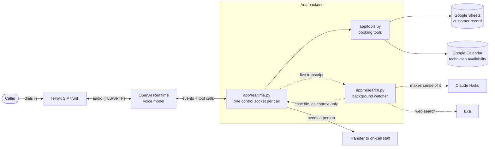

# Aria: AI phone agent

Aria is a standalone Python voice-agent project, located at `~/Aria`.
It includes the Summit Air inbound HVAC agent and an outbound calling module.
The existing Summit Air persona and deployment configuration are retained.

Summit Air runs 40 technicians across three counties, and its phones ring
off the hook every time a heat wave or cold snap hits. This agent answers
those inbound calls, works out what the caller needs, and books a service
visit, without a person picking up first.

## What it can do

The agent is responsible for problem discovery (no heat, no AC, a strange smell, routine
maintenance) and understanding property type i.e residential or commercial to best assist customers. It
weighs the caller's circumstances, and gauges based on urgency (routine maintenance or priority). The full triage logic lives in
[`app/agent/SYSTEM-PROMPT.md`](app/agent/SYSTEM-PROMPT.md).

After problem discovery, the agent collects relevant details to best understand how to assist customer.  Based on availability, it schedules the right time to solve the problem For anything it can't resolve, or a caller who needs a person right away, human escalation is added with necessary information

## Call flow



Solid arrows are the call itself. Dotted arrows are optional background research, which never holds up the conversation.

## Why these tools

- Telnyx connects straight to OpenAI's Realtime API over TLS/SRTP, with
nothing relaying or re-encoding audio in between. Fewer hops means less
latency and one less thing that can break mid-call.

- Google Sheets acts as a System of Record or a CRM for the agent to utilize and keep track of relevant details.

- Google Calendar is also used to ensure technician and agent can be aligned on schedule and necessary timeslots approved for work and solving the HVAC issues that customers call for

The model runs off a fixed system prompt plus three narrow tools
(`lookup`, `availability`, `book` in
[`app/tools.py`](app/tools.py)). The model handles conversations, while the tools handle anything that touches a real record. This ensure that the model is not hallucinating, enough to schedule a time on calendar without need for tool use

The backend is Python (Starlette), holding one control WebSocket per active call and dispatching each tool call as the model requests it.

Optional background research: while the caller talks, Claude Haiku reads the live transcript (including garbled speech-to-text) and runs an Exa web search when a useful fact appears, such as an address. The findings reach the voice model as unverified context, never as a tool call, so Aria can confirm details instead of asking for them without ever pausing. It's off by default; set `RESEARCH_ENABLED=true`, `ANTHROPIC_API_KEY` and `EXA_API_KEY` to turn it on.

Original repository: **https://github.com/sinmi-hub/SummitAir**. Deployment and
cutover notes are in [`deploy/README.md`](deploy/README.md).

## Pausing the live demo

The demo VM can be stopped and started on demand to control cost. While
stopped, the phone number won't answer. If the number doesn't pick up,
check `https://summitair.34.57.120.135.sslip.io/health`. It's likely
paused.

## Running it locally

Requires Python 3.11+.

```sh
cd ~/Aria
make install
cp .env.example .env
# Supply your own credentials
make test
make serve
```

## Repository hygiene

`.env.example` documents required configuration. Real values stay in an
ignored `.env` file, and service-account keys stay out of source control.
This repo includes a pre-commit hook that screens staged files for common
credential formats:

```sh
git config core.hooksPath .githooks
```
