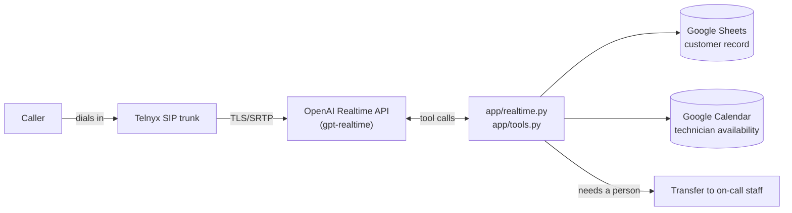

# Summit Air: AI phone agent

Summit Air runs 40 technicians across three counties, and its phones ring
off the hook every time a heat wave or cold snap hits. This agent answers
those inbound calls, works out what the caller needs, and books a service
visit, without a person picking up first.

## What it can do

The agent asks what's wrong (no heat, no AC, a strange smell, routine
maintenance) and whether the property is residential or commercial. It
weighs the caller's circumstances, not just keywords: a gas smell ends the
call and sends them to 911 immediately. The agent flags "no heat in January
with an elderly person in the house" as urgent even though the caller never
said the word "emergency," and books routine maintenance without that
urgency. The full triage logic lives in
[`app/agent/SYSTEM-PROMPT.md`](app/agent/SYSTEM-PROMPT.md).

Once it understands the issue, the agent collects name, callback number,
address, and availability in a back-and-forth conversation rather than a
form read aloud. It checks the shop's real calendar for open slots and
writes the booking back, so nothing it offers is a placeholder time. For
anything it can't resolve, or a caller who needs a person right away, it
transfers the call and passes along what it already learned, so the caller
doesn't repeat themselves.

## Call flow



## Why these tools

Telnyx connects straight to OpenAI's Realtime API over TLS/SRTP, with
nothing relaying or re-encoding audio in between. Fewer hops means less
latency and one less thing that can break mid-call.

The shop's customer list already lives in Google Sheets, so the agent
looks up real leads there instead of a second database nobody would keep
updated. Technician schedules already live in Google Calendar, and booking
through that same calendar keeps the agent's slots consistent with what
dispatch actually sees.

The model runs off a fixed system prompt plus three narrow tools
(`lookup`, `availability`, `book` in
[`app/tools.py`](app/tools.py)). The model handles the conversation; the
tools handle anything that touches a real record, so a booking is never
something the model invents on its own.

The backend is Python (FastAPI), holding one control WebSocket per active
call and dispatching each tool call as the model requests it.

Source code: **https://github.com/sinmi-hub/SummitAir**. Deployment and
cutover notes are in [`deploy/README.md`](deploy/README.md).

## Pausing the live demo

The demo VM can be stopped and started on demand to control cost. While
stopped, the phone number won't answer. If the number doesn't pick up,
check `https://summitair.34.57.120.135.sslip.io/health`. It's likely
paused.

## Running it locally

Requires Python 3.11+.

```sh
make install
cp .env.example .env
# Supply your own credentials
make test
make serve
```

## Repository hygiene

`.env.example` documents required configuration. Real values stay in an
ignored `.env` file, and service-account keys stay out of source control.
This repo includes a pre-commit hook that screens staged files for common
credential formats:

```sh
git config core.hooksPath .githooks
```
