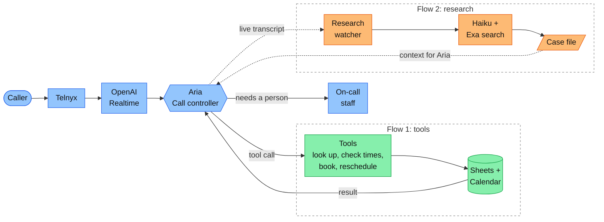

# Aria: AI phone agent

Aria is a voice-agent project built in Python. The project is based on a fictituous company called SummitAir. 
Summit Air is a company in need of an inbound HVAC agent and an outbound calling module.

The existing Summit Air persona and deployment configuration are retained.

Summit Air runs 40 technicians across three counties, and its phones ring
off the hook every time a heat wave or cold snap hits. This agent starts as entry point for inbound intake.

## What it can do

- The agent is responsible for problem discovery (no heat, no AC, a strange smell, routine maintenance) to understand how to  best assist customers. It attempts to weighs the caller's circumstances, and gauge the urgency

- After problem discovery, the agent collects relevant details to best understand how to assist customer so technician knows what to report too.

- Based on availability, it schedules the right time to solve the problem For anything that cannot resolve, or a caller who needs a person right away, human escalation is added with necessary information

## Call flow


```mermaid
%%{init: {"flowchart": {"curve": "basis", "nodeSpacing": 25, "rankSpacing": 35, "padding": 8}}}%%
flowchart LR
  Caller(["Caller"]) --> Telnyx["Telnyx"] --> OpenAI["OpenAI<br/>Realtime"] --> Core{{"Aria<br/>Call controller"}}

  subgraph Flow1["Flow 1: tools"]
    direction LR
    Tools["Tools<br/>look up, check times,<br/>book, reschedule"] --> Records[("Sheets +<br/>Calendar")]
  end

  subgraph Flow2["Flow 2: research"]
    direction LR
    Watcher["Research<br/>watcher"] --> Search["Haiku +<br/>Exa search"] --> Case[/"Case file"/]
  end

  Core -->|"tool call"| Tools
  Core -.->|"live transcript"| Watcher
  Records -->|"result"| Core
  Case -.->|"context for Aria"| Core
  Core -->|"needs a person"| Human["On-call<br/>staff"]

  classDef voice fill:#93c5fd,stroke:#2563eb,color:#111
  classDef tools fill:#86efac,stroke:#16a34a,color:#111
  classDef research fill:#fdba74,stroke:#ea580c,color:#111
  class Caller,Telnyx,OpenAI,Core,Human voice
  class Tools,Records tools
  class Watcher,Search,Case research

  style Flow1 fill:transparent,stroke:#888,stroke-dasharray:4 4
  style Flow2 fill:transparent,stroke:#888,stroke-dasharray:4 4
```

Sequence of call is split into 2 flows in the main application for real time calls.(app/realtime.py)

- Voice agent can connect and utilize certain tools to store information. 
- Real time lookup of certain information can be used to improve call naturalness

## Infra


- Telnyx connects straight to OpenAI's Realtime API over TLS/SRTP, with
nothing relaying or re-encoding audio in between. Latency is biggest factor here for architecture decision.

- Google Sheets acts as a System of Record or a CRM for the agent to utilize and keep track of relevant details.

- Google Calendar is also used to ensure technician and agent can be aligned on schedule and necessary timeslots approved for work and solving the HVAC issues that customers call for

- System prompt: The model runs off a fixed system prompt plus six narrow tools: `lookup`, `availability`, `book`, `reschedule`,
`transfer_to_human` and `end_call`.

  - Tool use by gpt-realtime-2.1 seems to be balanced. The right tool calls are usually made

- Backend: Python (Starlette). Designed around a single interface
  - `CallManager`: serves as a controller
    - Model asks for tool calls as a contract required by callManager. This ensures the right tools are being called and reduces hallucination for actions only.
    - Maintains different versions of calls that can be going on using a dictionary of `Call` objects. Constructor intialization shows this. This is the **_star_** of the show


- Background research. In order to increase naturalness on the call. Providing agent with relevant context on call, albeit external can reduce amount of steps customer has to get to. 

  -  Claude Haiku + Exa 
      - Model reads the live transcript  and runs an Exa web search when a useful fact appears, such as an address. The findings are available so Aria can confirm details instead of asking for them without ever pausing.

## Running it locally

Requires Python 3.11+.

```sh
cd ~/Aria
make install
cp .env.example .env
# Supply your own credentials
make test
make serve
```

## Live demo

- Read [deploy.md](deploy/README.md) to understand
- Validate that `https://summitair.34.57.120.135.sslip.io/health` is up.
