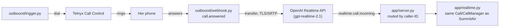

# Aria outbound: personal check-in call

A personal, one-off reuse of the SummitAir voice-agent architecture: an outbound
AI call that checks in on Sinmi's sister ahead of her move from Maryland to
Arizona for a military PCS. Not a business feature, not deployed as part of
Summit Air's own service — nested here so it can reuse the proven call-handling
machinery directly instead of duplicating it.

## What it can do

The agent discloses itself as an AI immediately, on Sinmi's behalf, and gives
the person an easy way to decline. From there it's a warm, open conversation,
not an intake script: how she's feeling about the move, whether she's booked a
hotel for the drive, what route she's planning, and two things chosen naturally
from her actual PCS checklist rather than a full audit. The full conversation
logic lives in [`SYSTEM-PROMPT.md`](SYSTEM-PROMPT.md).

## Call flow



## What each file does

- [`telnyx.py`](telnyx.py) — every Telnyx API call: `dial()` originates the call,
  `transfer_to_openai()` bridges the answered leg to OpenAI once she picks up,
  `hangup()` ends it, `get_connection_id()` looks up the Call Control
  Application by name.
- [`webhook.py`](webhook.py) — receives Telnyx's `call.answered` event and
  calls `transfer_to_openai()`. Signature-verified via `signature.py` before
  anything in the payload is trusted.
- [`signature.py`](signature.py) — verifies Telnyx's Ed25519 webhook signature,
  mirrored from the same proven code in `~/voice-agent`.
- [`trigger.py`](trigger.py) — the script you actually run to place the call:
  `python -m outbound.trigger <number> <webhook_url>`.
- [`persona.py`](persona.py) — the fixed opening disclosure line and closing
  goodbye text, spoken exactly as written rather than left to the model.
- [`SYSTEM-PROMPT.md`](SYSTEM-PROMPT.md) — everything about how the
  conversation itself should go: the AI disclosure, one-question-at-a-time
  rule, the four topics to cover, and how to handle a test call.
- [`tools.py`](tools.py) — the tool the model can call. Just `end_call`; no
  HVAC tools apply here.
- `app/server.py` (in the SummitAir root, not this folder) — where this
  actually gets wired in: a second `CallManager` built from the files above,
  and the caller-ID routing that sends the transferred-back-in call here
  instead of to SummitAir.
- [`astra-handoff.md`](astra-handoff.md) — not code; a copy-paste prompt for
  finding two things in the Telnyx/OpenAI dashboards. Local only.
- [`PROGRESS.md`](PROGRESS.md) — the working log of what's been built,
  verified, and decided, and what's still open. Local only, most complete
  record if you lose track of where this stands.

## Why this shape

- Telnyx Call Control is used for exactly one thing: originating the call.
  Once she answers, the leg is transferred straight to OpenAI's SIP endpoint —
  the same SIP-passthrough pattern SummitAir's inbound flow already uses, not
  the older Telnyx-media-streaming-plus-manual-bridge pattern from
  `~/voice-agent`, which this project deliberately moved away from.

- `app/realtime.py`'s `Call`/`CallManager` are reused directly via optional
  constructor parameters (`instructions`, `tools`, `handlers`, `greeting`,
  `closing_goodbye`), not duplicated. SummitAir's own call sites pass none of
  these and are unaffected; this project passes its own.

- One webhook endpoint (`/webhooks/openai`) legitimately serves both SummitAir
  and this call, since OpenAI's incoming-call webhook is registered once per
  project, not per number. `app/server.py` routes by the caller-ID in
  `data.sip_headers`, matching it against `OUTBOUND_FROM_NUMBER` — the one
  field in that payload that actually differs between the two.

- No PCS-specific tool exists. The report back to Sinmi is the same
  `agent_said`/`caller_said` journal logging SummitAir already produces, read
  after the call, not a dedicated tool or database.

Progress notes and open questions: [`PROGRESS.md`](PROGRESS.md) (local only,
not committed).

## Running it

Requires the same environment as SummitAir, plus:

```sh
TELNYX_API=...              # reused from ~/voice-agent's account
OUTBOUND_FROM_NUMBER=...    # a Telnyx Verified Number, distinct from Summit Air's own
CALL_CONTROL_APP_NAME=...   # defaults to "summitair-outbound"
OPENAI_SIP_URI=...          # sip:proj_...@sip.api.openai.com:5061;transport=tls
```

Placing a call, once deployed somewhere publicly reachable (the webhook needs a
real URL Telnyx and OpenAI can reach):

```sh
python -m outbound.trigger +1XXXXXXXXXX https://HOST/webhooks/telnyx-outbound
```

## Repository hygiene

Inherits SummitAir's `.env`/pre-commit setup — see the root
[`README.md`](../README.md). `PROGRESS.md` and `astra-handoff.md` here are
local working notes, gitignored, same pattern as the root project's.
